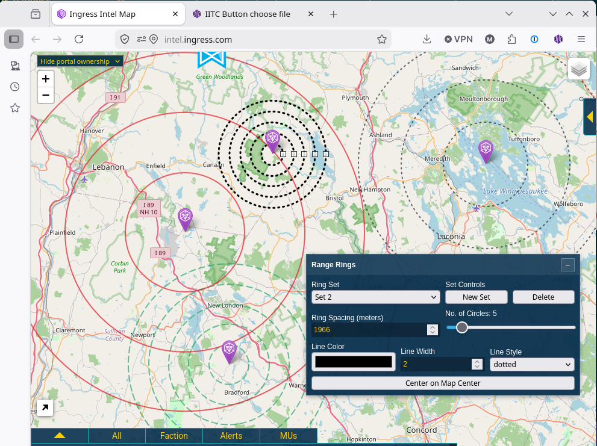

# IITC Plugin: Range Rings

Range Rings is an IITC plugin that draws concentric range rings from draggable center points.

**Install:** [`range-rings.user.js`](https://github.com/mdiehn/iitc-plugin-range-rings/raw/refs/heads/main/dist/range-rings.user.js)

## Screenshot

Range Rings lets you place and edit multiple concentric ring sets on the IITC map, with draggable centers and live ring spacing controls.



## Features

- Multiple ring sets
- Draggable center marker for each set
- Multiple rings at equal spacing
- Configurable ring spacing
- Configurable number of circles
- Configurable line color
- Configurable line width
- Configurable line style
- Floating, draggable, collapsible control panel
- Persistent settings stored in browser localStorage
- Draggable resize handles for the active ring set

## Usage

- Enable the `Range Rings` layer in IITC.
- Drag a center marker to move that ring set.
- Click a marker or ring to make that set active.
- Use the `Ring Set` selector to switch between sets.
- Use `New Set` to create another ring set.
- New sets are created near the active set instead of directly on top of it.
- Use `Delete` to remove the active ring set.
- Adjust spacing, circle count, and line style settings in the control panel.
- Use `Center on Map Center` to move the active set to the current map center.
- Drag a resize handle on the active set to change ring spacing.

## Development

Source files live under `src/`.

Build the distributable userscript with:

```bash
./build.sh
```
This writes
* dist/range-rings.user.js

## Installation

Requires IITC-CE.

- Desktop: install [`range-rings.user.js`](https://github.com/mdiehn/iitc-plugin-range-rings/raw/refs/heads/main/dist/range-rings.user.js)
- Mobile: download/import the same file in IITC Mobile / AITC Mobile

## Notes

Settings are stored in browser localStorage. Removing and reinstalling the plugin does not automatically clear saved settings.

## Status

Active development.